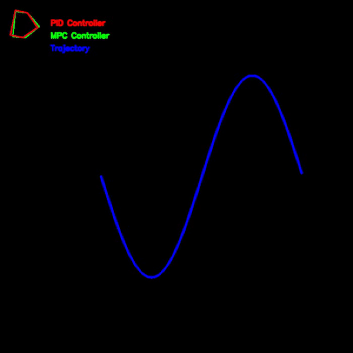

# Differential Drive Robot Navigation

This repository simulates a two wheeled differential drive robot. The robot is placed in an empty environment and it follows a path. The robot can follow a given path using either a PID controller or a Model Predictive Controller (MPC).

## Simulation Details
The mathematical models of robot kinematics and state update are used to simulate the robot movement. The robot inputs are the linear and angular velocities and the robot state consists of `x`, `y` and `θ`. The MPC and the PID controllers try to minimize the distance and angle between the robot centroid and the path point which in turn makes the robot follow its path. 

The robot is rendered using openCV.

## Running the code
You can either run the `main.py` file or the `controller_comparison.py`. When running the `main.py` the following command should be type:

```
python main.py controller_name
```

Where `controller_name` can either be `MPC` or `PID`. Once the `main.py` if executed the user has to click on the screen to place way points and the robot will try to follow the path.

Users can alternatively run the following command:
```
python controller_comparison.py
```

This will start the program where two cars (one controlled by MPC and the other by PID) have to follow a predefined path.

The gif below shows the result of the controller comparison.

<p align="center">
  
</p>