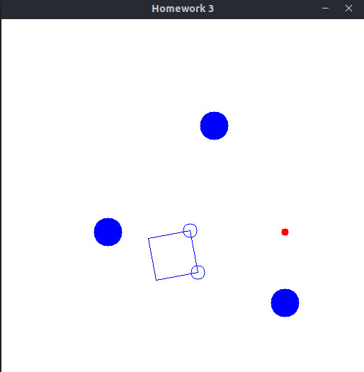
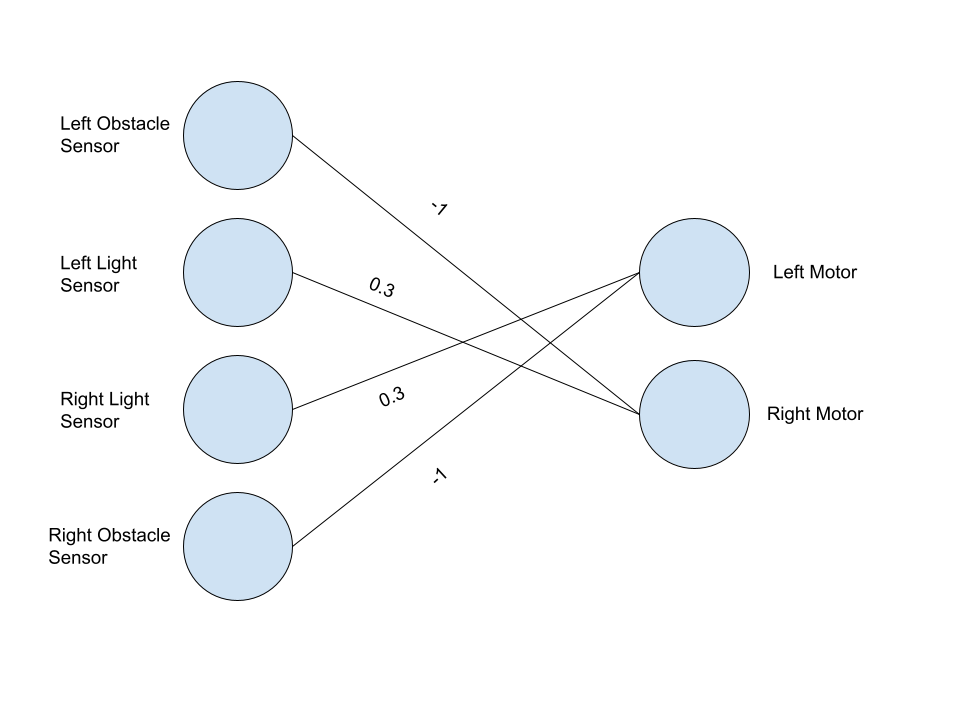

# Differential Drive Robot Navigation

### Forked repo
This repository is a fork of a project that simulates a two wheeled differential drive robot. The robot is placed in an environment and it follows a target. I have made changes so that the robot can be controlled by variables set in the program. Also, tried to create a neural network that will control it move closer to the target and simultaneuosly avoid the obstacles. 

### Neural Network
In Figure 2 you can see the neural network that I created for this task. Whenever the
obstacle sensor hits the obstacle, it activates the opposite motor. For example, if LO = 1, then
RM = -1. I implemented it by comparing the coordinates of the sensor and the obstacle itself, so
when they are equal, the robot knows that it is hitting the obstacle and activates the output. For
the light sensor to work, the robot measures the distance to the light source from each sensor and
finds the difference. So, if the left sensor minus right sensor is bigger than the constant, it meansthat the light source is closer to the right sensor, therefore it activates the RO = 1. The light
sensor is located at the exact coordinates and it is hard coded there. So, the robot is calculating
the distance to a certain point, not to the object.
The neural network works this way: the robot is driving towards the light source and if it hits the
obstacle it backs up a little and continues its journey. The formula for the left motor is (0.3*rl -
1*ro)*2, where 0.3 is the weight of the light sensor, rl = right light source, -1 weight of the
obstacle sensor, ro = right obstacle sensor. I know that the robot is not working perfectly, but this
is due to the limited number of sensors.  

  
  <figcaption>
  labelname :: Figure 1.
  </figcaption>

  
  <figcaption>
  labelname :: Figure 2.
  </figcaption>

